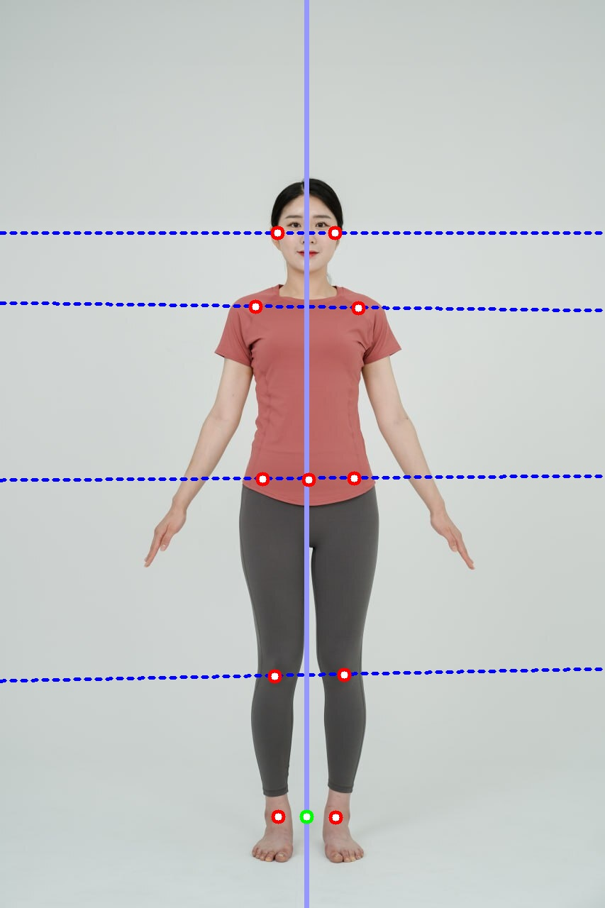
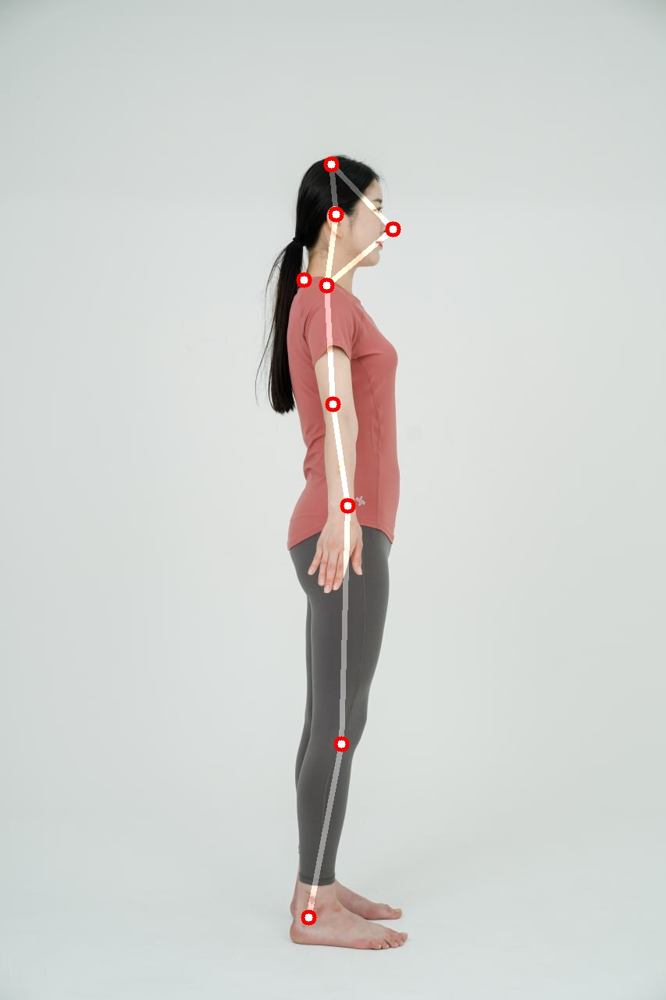
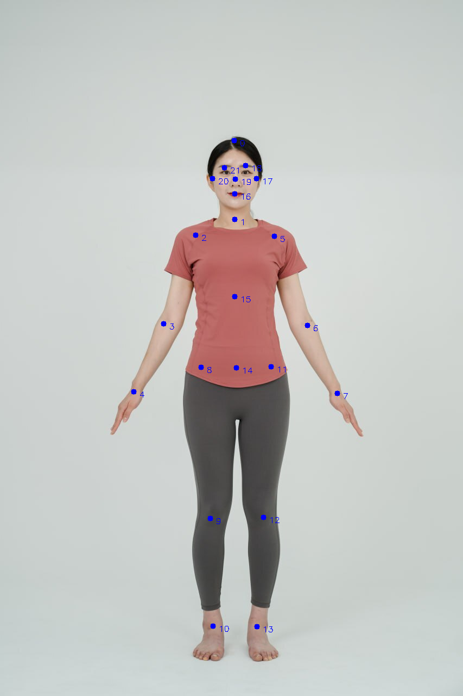

# 골격 분석(후면 분석 추가)

### front image

<figure><figcaption></figcaption></figure>

### side image

<figure><figcaption></figcaption></figure>

### back image

<figure><figcaption></figcaption></figure>

### keypoint index

<figure><figcaption></figcaption></figure>

<table><thead><tr><th width="104">index</th><th>joint</th></tr></thead><tbody><tr><td>0</td><td>HeadTop</td></tr><tr><td>1</td><td>Neck</td></tr><tr><td>2</td><td>RightShoulder</td></tr><tr><td>3</td><td>RightElbow</td></tr><tr><td>4</td><td>RightWrist</td></tr><tr><td>5</td><td>LeftShoulder</td></tr><tr><td>6</td><td>LeftElbow</td></tr><tr><td>7</td><td>LeftWrist</td></tr><tr><td>8</td><td>RightASIS</td></tr><tr><td>9</td><td>RightKnee</td></tr><tr><td>10</td><td>RightAnkle</td></tr><tr><td>11</td><td>LeftASIS</td></tr><tr><td>12</td><td>LeftKnee</td></tr><tr><td>13</td><td>LeftAnkle</td></tr><tr><td>14</td><td>Pelvis</td></tr><tr><td>15</td><td>Spine1</td></tr><tr><td>16</td><td>Lips</td></tr><tr><td>17</td><td>LeftEar</td></tr><tr><td>18</td><td>LeftEye</td></tr><tr><td>19</td><td>Nose</td></tr><tr><td>20</td><td>RightEar</td></tr><tr><td>21</td><td>RightEye</td></tr></tbody></table>
