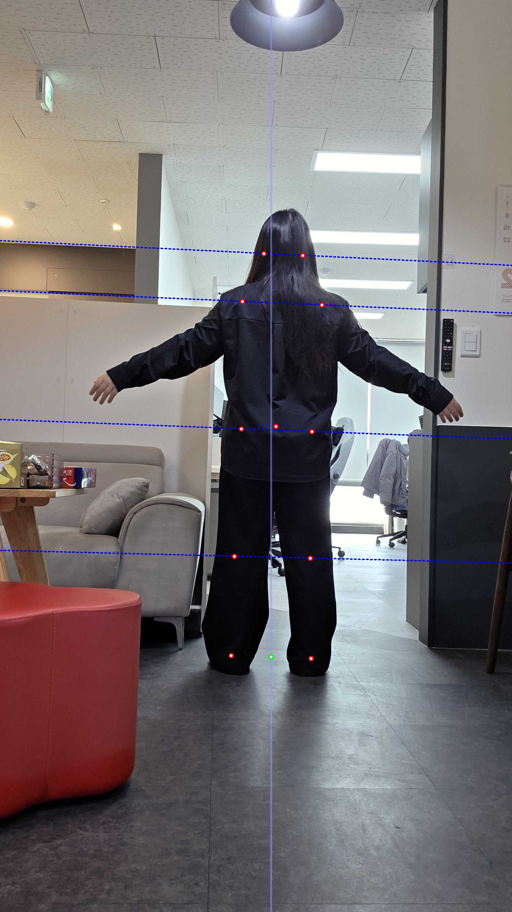

# Image Skeleton Analysis Request

### Image Skeleton Analysis Request

<mark style="color:green;">`POST`</mark> `http://api.remo.re.kr/api/analysis-skeleton-v2`

Analyzes body skeleton by receiving front and side photos.

**Parameters(json)**

<table><thead><tr><th>Name</th><th>Type</th><th>Description</th><th data-type="checkbox">Required</th></tr></thead><tbody><tr><td><code>Email</code></td><td>string</td><td>User email address</td><td>true</td></tr><tr><td><code>UserKey</code></td><td>string</td><td>Issued user key value</td><td>true</td></tr><tr><td><code>APIKey</code></td><td>string</td><td>Issued API key value</td><td>true</td></tr><tr><td><code>forigimg</code></td><td>string(base64)</td><td>Base64 encoded front photo</td><td>true</td></tr><tr><td><code>sorigimg</code></td><td>string(base64)</td><td>Base64 encoded side photo</td><td>true</td></tr><tr><td><code>borigimg</code></td><td>string(base64)</td><td>Base64 encoded back photo</td><td>true</td></tr></tbody></table>

**Response(json)**

\*Left and right criteria are based on the subject in the photo

<table><thead><tr><th width="282">Name</th><th width="94">Type</th><th>Description</th></tr></thead><tbody><tr><td><code>state</code></td><td>bool</td><td>True on success, False on failure</td></tr><tr><td><code>status_code</code></td><td>int</td><td>200 on success, error code on failure</td></tr><tr><td><code>uuid</code></td><td>string</td><td>UUID received as parameter</td></tr><tr><td><code>credit_change</code></td><td>int</td><td>Amount of credits used in analysis</td></tr><tr><td><code>credit</code></td><td>int</td><td>Current credit balance</td></tr><tr><td><code>forigimg</code></td><td>string</td><td>Base64 encoded image with results drawn on front photo</td></tr><tr><td><code>sorigimg</code></td><td>string</td><td>Base64 encoded image with results drawn on side photo</td></tr><tr><td><code>borigimg</code></td><td>string</td><td>Base64 encoded image with results drawn on back photo</td></tr><tr><td><code>far_coords</code></td><td>string</td><td>Front 2D skeleton coordinates converted to JSON string</td></tr><tr><td><code>far_head_bal_m_</code></td><td>float</td><td>Head balance (head tilt). In degrees.</td></tr><tr><td><code>far_head_bal_grade</code></td><td>int</td><td><p>Head balance (head tilt).</p><p>-2: Tilted upward to the right danger (value&#x3C;=-4)</p><p>-1: Tilted upward to the right caution (-4&#x3C;value&#x3C;=-1)</p><p>0: Normal (-1&#x3C;value&#x3C;1)</p><p>1: Tilted upward to the left caution (1&#x3C;=value&#x3C;4)</p><p>2: Tilted upward to the left danger (value>=4)</p></td></tr><tr><td><code>far_pelvic_bal_m_</code></td><td>float</td><td>Pelvic balance (pelvic tilt). In degrees.</td></tr><tr><td><code>far_pelvic_bal_grade</code></td><td>int</td><td><p>Pelvic balance (pelvic tilt).<br>-2: Tilted upward to the right danger (value&#x3C;=-4)</p><p>-1: Tilted upward to the right caution (-4&#x3C;value&#x3C;=-1)</p><p>0: Normal (-1&#x3C;value&#x3C;1)</p><p>1: Tilted upward to the left caution (1&#x3C;=value&#x3C;4)</p><p>2: Tilted upward to the left danger (value>=4)</p></td></tr><tr><td><code>far_shoulder_bal_m_</code></td><td>float</td><td>Shoulder balance (shoulder tilt). In degrees.</td></tr><tr><td><code>far_shoulder_bal_grade</code></td><td>int</td><td><p>Shoulder balance (shoulder tilt). <br>-2: Tilted upward to the right danger (value&#x3C;=-4)</p><p>-1: Tilted upward to the right caution (-4&#x3C;value&#x3C;=-1)</p><p>0: Normal (-1&#x3C;value&#x3C;1)</p><p>1: Tilted upward to the left caution (1&#x3C;=value&#x3C;4)</p><p>2: Tilted upward to the left danger (value>=4)</p></td></tr><tr><td><code>far_left_qang_m_</code></td><td>float</td><td>Left bow-leggedness value. In degrees.</td></tr><tr><td><code>far_left_qang_grade</code></td><td>int</td><td><p>Left bow-leggedness value assessment. <br>-2: X-legs danger (value&#x3C;=-12) </p><p>-1: X-legs caution (-12&#x3C;value&#x3C;=-6) </p><p>0: Normal (-6&#x3C;value&#x3C;6) </p><p>1: O-legs caution (6&#x3C;=value&#x3C;12) </p><p>2: O-legs danger (value>=12)</p></td></tr><tr><td><code>far_right_qang_m_</code></td><td>float</td><td>Right bow-leggedness value. In degrees.</td></tr><tr><td><code>far_right_qang_grade</code></td><td>int</td><td><p>Right bow-leggedness value assessment. <br>-2: X-legs danger (value&#x3C;=-12) </p><p>-1: X-legs caution (-12&#x3C;value&#x3C;=-6) </p><p>0: Normal (-6&#x3C;value&#x3C;6) </p><p>1: O-legs caution (6&#x3C;=value&#x3C;12) </p><p>2: O-legs danger (value>=12)</p></td></tr><tr><td><code>far_knee_bal_m_</code></td><td>float</td><td>Knee balance (knee tilt). In degrees.</td></tr><tr><td><code>far_knee_bal_grade</code></td><td>int</td><td><p>Knee balance (knee tilt) assessment. <br>-2: Tilted upward to the right danger (value&#x3C;=-4)</p><p>-1: Tilted upward to the right caution (-4&#x3C;value&#x3C;=-1)</p><p>0: Normal (-1&#x3C;value&#x3C;1)</p><p>1: Tilted upward to the left caution (1&#x3C;=value&#x3C;4)</p><p>2: Tilted upward to the left danger (value>=4)</p></td></tr><tr><td><code>far_tilt_m_</code></td><td>float</td><td>Front axis tilt (left-right tilt). In degrees.</td></tr><tr><td><code>far_tilt_grade</code></td><td>int</td><td><p>Front axis tilt (left-right tilt) assessment. <br>-2: Tilted upward to the right danger (value&#x3C;=-4)</p><p>-1: Tilted upward to the right caution (-4&#x3C;value&#x3C;=-1)</p><p>0: Normal (-1&#x3C;value&#x3C;1)</p><p>1: Tilted upward to the left caution (1&#x3C;=value&#x3C;4)</p><p>2: Tilted upward to the left danger (value>=4)</p></td></tr><tr><td><code>round_shoulder_m_</code></td><td>float</td><td>Rounded shoulder tilt. In degrees.</td></tr><tr><td><code>round_shoulder_grade</code></td><td>int</td><td>Rounded shoulder tilt assessment. <br>0: Normal (value&#x3C;=8) <br>1: Caution (8&#x3C;value&#x3C;15) <br>2: Danger (value>=15)</td></tr><tr><td><code>sar_coords</code></td><td>string</td><td>Side 2D skeleton coordinates converted to JSON string</td></tr><tr><td><code>sar_head_tilt_grade</code></td><td>int</td><td><p>Side head balance (side head tilt) assessment. <br>-2: Tilted backward danger (value&#x3C;=-4)</p><p>-1: Tilted backward caution (-4&#x3C;value&#x3C;=-1)</p><p>0: Normal (-1&#x3C;value&#x3C;1)</p><p>1: Tilted forward caution (1&#x3C;=value&#x3C;4)</p><p>2: Tilted forward danger (value>=4)</p></td></tr><tr><td><code>sar_head_tilt_m_</code></td><td>float</td><td>Side head balance (head forward-backward tilt). In degrees.</td></tr><tr><td><code>sar_tilt_m_</code></td><td>float</td><td>Side tilt (whole body forward-backward tilt). In degrees.</td></tr><tr><td><code>sar_tilt_grade</code></td><td>int</td><td><p>Side tilt (whole body forward-backward tilt) assessment. <br>-2: Tilted backward danger (value&#x3C;=-4)</p><p>-1: Tilted backward caution (-4&#x3C;value&#x3C;=-1)</p><p>0: Normal (-1&#x3C;value&#x3C;1)</p><p>1: Tilted forward caution (1&#x3C;=value&#x3C;4)</p><p>2: Tilted forward danger (value>=4)</p></td></tr><tr><td><code>turtle_neck_m_</code></td><td>float</td><td>Turtle neck tilt. In degrees.</td></tr><tr><td><code>turtle_neck_grade</code></td><td>int</td><td>Turtle neck tilt assessment. <br>0: Normal (value&#x3C;=34) <br>1: Caution (34&#x3C;value&#x3C;40) <br>2: Danger (value>=40)</td></tr><tr><td><code>bar_coords</code></td><td>string</td><td>Back 2D skeleton coordinates converted to JSON string</td></tr><tr><td><code>bar_head_bal_m_</code></td><td>float</td><td>Head balance (head tilt). In degrees.</td></tr><tr><td><code>bar_head_bal_grade</code></td><td>int</td><td><p>Head balance (head tilt).</p><p>-2: Tilted upward to the right danger (value&#x3C;=-4)</p><p>-1: Tilted upward to the right caution (-4&#x3C;value&#x3C;=-1)</p><p>0: Normal (-1&#x3C;value&#x3C;1)</p><p>1: Tilted upward to the left caution (1&#x3C;=value&#x3C;4)</p><p>2: Tilted upward to the left danger (value>=4)</p></td></tr><tr><td><code>bar_pelvic_bal_m_</code></td><td>float</td><td>Pelvic balance (pelvic tilt). In degrees.</td></tr><tr><td><code>bar_pelvic_bal_grade</code></td><td>int</td><td><p>Pelvic balance (pelvic tilt).<br>-2: Tilted upward to the right danger (value&#x3C;=-4)</p><p>-1: Tilted upward to the right caution (-4&#x3C;value&#x3C;=-1)</p><p>0: Normal (-1&#x3C;value&#x3C;1)</p><p>1: Tilted upward to the left caution (1&#x3C;=value&#x3C;4)</p><p>2: Tilted upward to the left danger (value>=4)</p></td></tr><tr><td><code>bar_shoulder_bal_m_</code></td><td>float</td><td>Shoulder balance (shoulder tilt). In degrees.</td></tr><tr><td><code>bar_shoulder_bal_grade</code></td><td>int</td><td><p>Shoulder balance (shoulder tilt).<br>-2: Tilted upward to the right danger (value&#x3C;=-4)</p><p>-1: Tilted upward to the right caution (-4&#x3C;value&#x3C;=-1)</p><p>0: Normal (-1&#x3C;value&#x3C;1)</p><p>1: Tilted upward to the left caution (1&#x3C;=value&#x3C;4)</p><p>2: Tilted upward to the left danger (value>=4)</p></td></tr><tr><td><code>bar_left_qang_m_</code></td><td>float</td><td>Left bow-leggedness value. In degrees.</td></tr><tr><td><code>bar_left_qang_grade</code></td><td>int</td><td><p>Left bow-leggedness value assessment.<br>-2: X-legs danger (value&#x3C;=-12)</p><p>-1: X-legs caution (-12&#x3C;value&#x3C;=-6)</p><p>0: Normal (-6&#x3C;value&#x3C;6)</p><p>1: O-legs caution (6&#x3C;=value&#x3C;12)</p><p>2: O-legs danger (value>=12)</p></td></tr><tr><td><code>bar_right_qang_m_</code></td><td>float</td><td>Right bow-leggedness value. In degrees.</td></tr><tr><td><code>bar_right_qang_grade</code></td><td>int</td><td><p>Right bow-leggedness value assessment.<br>-2: X-legs danger (value&#x3C;=-12)</p><p>-1: X-legs caution (-12&#x3C;value&#x3C;=-6)</p><p>0: Normal (-6&#x3C;value&#x3C;6)</p><p>1: O-legs caution (6&#x3C;=value&#x3C;12)</p><p>2: O-legs danger (value>=12)</p></td></tr><tr><td><code>bar_knee_bal_m_</code></td><td>float</td><td>Knee balance (knee tilt). In degrees.</td></tr><tr><td><code>bar_knee_bal_grade</code></td><td>int</td><td><p>Knee balance (knee tilt) assessment.<br>-2: Tilted upward to the right danger (value&#x3C;=-4)</p><p>-1: Tilted upward to the right caution (-4&#x3C;value&#x3C;=-1)</p><p>0: Normal (-1&#x3C;value&#x3C;1)</p><p>1: Tilted upward to the left caution (1&#x3C;=value&#x3C;4)</p><p>2: Tilted upward to the left danger (value>=4)</p></td></tr><tr><td><code>bar_tilt_m_</code></td><td>float</td><td>Back axis tilt (left-right tilt). In degrees.</td></tr><tr><td><code>bar_tilt_grade</code></td><td>int</td><td><p>Back axis tilt (left-right tilt) assessment.<br>-2: Tilted upward to the right danger (value&#x3C;=-4)</p><p>-1: Tilted upward to the right caution (-4&#x3C;value&#x3C;=-1)</p><p>0: Normal (-1&#x3C;value&#x3C;1)</p><p>1: Tilted upward to the left caution (1&#x3C;=value&#x3C;4)</p><p>2: Tilted upward to the left danger (value>=4)</p></td></tr></tbody></table>

**Request Example**

```json
{
  "Email": "example@email.com",
  "UserKey": "userkey",
  "APIKey": "apikey",
  "forigimg": "/9j/4AAQSkZJRgABAQAAAQABAAD/2wBDAAIBAQEBAQIBAQECAgICAgQDAgICAgUEBAMEBgUGBgYFBgYGBw ... (omitted)(result of converting image to bytes)",
  "sorigimg": "/9j/4AAQSkZJRgABAQAAAQABAAD/2wBDAAIBAQEBAQIBAQECAgICAgQDAgICAgUEBAMEBgUGBgYFBgYGBw ... (omitted)(result of converting image to bytes)",
  "borigimg": "/9j/4AAQSkZJRgABAQAAAQABAAD/2wBDAAIBAQEBAQIBAQECAgICAgQDAgICAgUEBAMEBgUGBgYFBgYGBw ... (omitted)(result of converting image to bytes)"
 }
```

**Example Code**



```bash
curl -X POST "http://api.remo.re.kr/api/analysis-skeleton-v2" \
-H "Content-Type: application/json" \
-d '{
    "Email": "your_email",
    "UserKey": "your_user_key",
    "APIKey": "your_api_key",
    "forigimg": "'$(base64 -w 0 path/to/your/front/image)'",
    "sorigimg": "'$(base64 -w 0 path/to/your/side/image)'",
    "borigimg": "'$(base64 -w 0 path/to/your/back/image)'"
}'
```



```python
import requests
import uuid
import base64

fimg_path = "path/to/your/front/image"
simg_path = "path/to/your/side/image"
bimg_path = "path/to/your/back/image"

with open(fimg_path, "rb") as img_file:
    fimg_b64 = base64.b64encode(img_file.read()).decode('utf-8')
with open(simg_path, "rb") as img_file:
    simg_b64 = base64.b64encode(img_file.read()).decode('utf-8')
with open(bimg_path, "rb") as img_file:
    bimg_b64 = base64.b64encode(img_file.read()).decode('utf-8')

task_uuid = str(uuid.uuid4())
rq_dict = {'Email': "your_email", "UserKey": "your_user_key", "APIKey": "your_api_key", "forigimg": fimg_b64, "sorigimg": simg_b64, "borigimg": bimg_b64}

res = requests.post("http://api.remo.re.kr/api/analysis-skeleton-v2", json=rq_dict)
```



```javascript
import fetch from 'node-fetch';
import fs from 'fs';
import { v4 as uuidv4 } from 'uuid';

const fimg_path = "path/to/your/front/image";
const simg_path = "path/to/your/side/image";
const bimg_path = "path/to/your/back/image";

const fimg_b64 = fs.readFileSync(fimg_path, { encoding: 'base64' });
const simg_b64 = fs.readFileSync(simg_path, { encoding: 'base64' });
const bimg_b64 = fs.readFileSync(bimg_path, { encoding: 'base64' });

const task_uuid = uuidv4();
const rq_dict = {
  Email: "your_email",
  UserKey: "your_user_key",
  APIKey: "your_api_key",
  forigimg: fimg_b64,
  sorigimg: simg_b64,
  borigimg: bimg_b64,
};

fetch("http://api.remo.re.kr/api/analysis-skeleton-v2", {
  method: 'POST',
  headers: {
    'Content-Type': 'application/json'
  },
  body: JSON.stringify(rq_dict)
})
.then(response => response.json())
.then(data => console.log(data))
.catch(error => console.error('Error:', error));

```



**Result Images**

<figure><figcaption><p>fronigimg</p></figcaption></figure>

<figure><figcaption><p>sorigimg</p></figcaption></figure>

<figure><figcaption><p>borigimg</p></figcaption></figure>

**Response Example**



```json
{
  'state': True,
  'status_code': 200,
  'APIName': 'Analysis-skeleton-v2',
  'credit_change': -1,
  'credit': 99984228,
  'uuid': '59e9a3a1-a8d2-42a1-b2af-3a87cd01f682',
  'forigimg': 'data:image/jpeg;base64,/9j/4A ... (abbreviated) ... A8x//2Q==',
  'sorigimg': 'data:image/jpeg;base64,/9j/4A ... (abbreviated) ... A8x//2Q==',
  'borigimg': 'data:image/jpeg;base64,/9j/4A ... (abbreviated) ... A8x//2Q==',
  'bar_coords': '[[1060, 816], [1053, 1079], [1199, 1134], [1417, 1340], [1609, 1465], [903, 1121], [661, 1301], [448, 1397], [1162, 1605], [1156, 2076], [1159, 2449], [899, 1595], [873, 2069], [861, 2438], [1028, 1586], [1042, 1358], [1054, 991], [983, 943], [1007, 937], [1034, 979], [1128, 950], [1075, 940]]',
  'bar_head_bal_grade': 0,
  'bar_head_bal_m_': -0.011,
  'bar_knee_bal_grade': 0,
  'bar_knee_bal_m_': -0.312,
  'bar_left_qang_grade': 0,
  'bar_left_qang_m_': 0.665,
  'bar_pelvic_bal_grade': 0,
  'bar_pelvic_bal_m_': 0.299,
  'bar_right_qang_grade': 0,
  'bar_right_qang_m_': 2.109,
  'bar_shoulder_bal_grade': 0,
  'bar_shoulder_bal_m_': 0.544,
  'bar_tilt_grade': 0,
  'bar_tilt_m_': -0.125,
  'far_coords': '[[431, 258], [432, 403], [360, 432], [301, 595], [246, 720], [505, 434], [566, 598], [621, 723], [370, 675], [387, 953], [392, 1151], [499, 674], [485, 951], [473, 1152], [435, 676], [432, 545], [432, 356], [472, 328], [452, 304], [433, 329], [391, 328], [413, 308]]',
  'far_head_bal_grade': 1,
  'far_head_bal_m_': 1.393,
  'far_knee_bal_grade': 0,
  'far_knee_bal_m_': 0.57,
  'far_left_qang_grade': 0,
  'far_left_qang_m_': -2.529,
  'far_pelvic_bal_grade': 1,
  'far_pelvic_bal_m_': 1.153,
  'far_right_qang_grade': 0,
  'far_right_qang_m_': -4.368,
  'far_shoulder_bal_grade': 0,
  'far_shoulder_bal_m_': 0.483,
  'far_tilt_grade': 0,
  'far_tilt_m_': 0.958,
  'round_shoulder_grade': 0,
  'round_shoulder_m_': 2.698,
  'sar_coords': '[[424, 210], [418, 365], [419, 382], [435, 527], [437, 659], [423, 406], [434, 550], [448, 649], [435, 651], [437, 952], [395, 1174], [439, 650], [431, 931], [398, 1143], [445, 647], [425, 517], [426, 314], [433, 293], [485, 275], [503, 293], [430, 274], [484, 266]]',
  'sar_head_tilt_grade': -1,
  'sar_head_tilt_m_': -2.227,
  'sar_tilt_grade': 2,
  'sar_tilt_m_': 6.37,
  'turtle_neck_grade': 0,
  'turtle_neck_m_': 29.711
}
```



```json
{
  "state": False,
  "credit": 100,
  "message": 'error from front image decoding b64',
  "status":413
}
```



```json
{
  "state": False,
  "credit": 100,
  "message": 'In the side image, the model is not facing side ',
  "status": 515
}
```



**Error Code Guide**

| Main Category | Sub Category | Code |
| ------------ | ---------------------- | --- |
| Input Data Issue | Protocol Error | 400 |
|              | No Input Data | 411 |
|              | Attached Image Error | 412 |
|              | Front Image Error | 413 |
|              | Side Image Error | 414 |
|              | Photo Tilted More Than 10 Degrees (Front) | 418 |
| Other Issues | User Not Verified | 420 |
|              | Invalid APIKey | 421 |
|              | Insufficient Credit | 422 |
| Analysis Issues | Person Not Detected in Front Photo | 511 |
|              | Person Not Detected in Side Photo | 512 |
|              | Person Not Detected in Front and Side Photos | 513 |
|              | Incorrect Angle in Front Photo | 514 |
|              | Incorrect Angle in Side Photo | 515 |
|              | Incorrect Angle in Front and Side Photos | 516 |
|              | Front Image Not in A-Pose | 517 |
|              | Person Not Detected in Back Photo | 518 |
|              | Person Not Detected in Front and Back Photos | 519 |
|              | Person Not Detected in Side and Back Photos | 520 |
|              | Person Not Detected in Front, Side, and Back Photos | 521 |
|              | Incorrect Angle in Back Photo | 522 |
|              | Incorrect Angle in Front and Back Photos | 523 |
|              | Incorrect Angle in Side and Back Photos | 524 |
|              | Incorrect Angle in Front, Side, and Back Photos | 525 |
| Process Errors | Process Handling Error | 550 |
|              | Other Process Handling Errors | 559 |

**Viewing Request Image Results**



```python
import requests
import uuid
import base64
import cv2
import numpy as np
import uuid

fimg_path = "path/to/your/front/image"
simg_path = "path/to/your/side/image"
bimg_path = "path/to/your/back/image"

with open(fimg_path, "rb") as img_file:
    fimg_b64 = base64.b64encode(img_file.read()).decode('utf-8')
with open(simg_path, "rb") as img_file:
    simg_b64 = base64.b64encode(img_file.read()).decode('utf-8')
with open(bimg_path, "rb") as img_file:
    bimg_b64 = base64.b64encode(img_file.read()).decode('utf-8')

task_uuid = str(uuid.uuid4())
rq_dict = {'Email': "your_email", "UserKey": "your_user_key", "APIKey": "your_api_key", 'uuid': task_uuid, "forigimg": fimg_b64, "sorigimg": simg_b64, "borigimg": bimg_b64}
res = requests.post("http://api.remo.re.kr/api/analysis-skeleton", json=rq_dict).json()

#Convert front image analysis result data from byte data to array data
fimg_b64 = res["forigimg"] 
f_bytes = base64.b64decode(split_b64_video(fimg_b64).encode('utf-8'))
front_nparr = np.frombuffer(f_bytes, np.uint8)
front_img = cv2.imdecode(front_nparr, cv2.IMREAD_COLOR)

#Convert side image analysis result data from byte data to array data
simg_b64 = res["sorigimg"] #Side image analysis result data
s_bytes = base64.b64decode(split_b64_video(simg_b64).encode('utf-8'))
side_nparr = np.frombuffer(s_bytes, np.uint8)
side_img = cv2.imdecode(side_nparr, cv2.IMREAD_COLOR)

#Convert back image analysis result data from byte data to array data
bimg_b64 = res["borigimg"] #Back image analysis result data
b_bytes = base64.b64decode(split_b64_video(bimg_b64).encode('utf-8'))
back_nparr = np.frombuffer(b_bytes, np.uint8)
back_img = cv2.imdecode(back_nparr, cv2.IMREAD_COLOR)

# Display the image using OpenCV
cv2.imshow('front_img', front_img)
cv2.imshow('side_img', side_img)
cv2.imshow('back_img', back_img)
cv2.waitKey(0)
cv2.destroyAllWindows()
```

