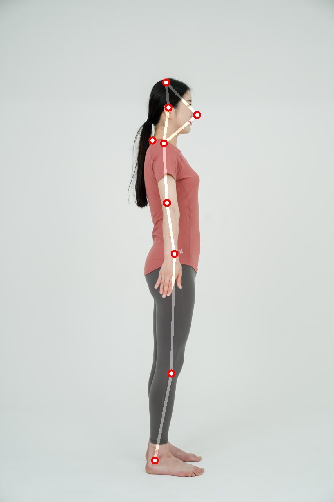

# Request Skeleton Analysis

## Image Skeleton Analysis Request

<mark style="color:green;">`POST`</mark> `http://api.remo.re.kr/api/analysis-skeleton`

Analyzes body skeleton using front and side view photos.

**Parameters(json)**

<table><thead><tr><th>Name</th><th>Type</th><th>Description</th><th data-type="checkbox">Required</th></tr></thead><tbody><tr><td><code>Email</code></td><td>string</td><td>User email address</td><td>true</td></tr><tr><td><code>UserKey</code></td><td>string</td><td>Issued user key value</td><td>true</td></tr><tr><td><code>APIKey</code></td><td>string</td><td>Issued API key value</td><td>true</td></tr><tr><td><code>forigimg</code></td><td>string(base64)</td><td>Front photo encoded in base64</td><td>true</td></tr><tr><td><code>sorigimg</code></td><td>string(base64)</td><td>Side photo encoded in base64</td><td>true</td></tr></tbody></table>

**Response(json)**

\*Left and right directions are based on the subject's perspective in the photo

<table><thead><tr><th width="282">Name</th><th width="94">Type</th><th>Description</th></tr></thead><tbody><tr><td><code>state</code></td><td>bool</td><td>True if successful, False if failed</td></tr><tr><td><code>status_code</code></td><td>int</td><td>200 if successful, error code if failed</td></tr><tr><td><code>uuid</code></td><td>string</td><td>UUID received as parameter</td></tr><tr><td><code>credit_change</code></td><td>int</td><td>Amount of credits used in analysis</td></tr><tr><td><code>credit</code></td><td>int</td><td>Current credit balance</td></tr><tr><td><code>forigimg</code></td><td>string</td><td>Front view image with results drawn, encoded in base64</td></tr><tr><td><code>sorigimg</code></td><td>string</td><td>Side view image with results drawn, encoded in base64</td></tr><tr><td><code>far_coords</code></td><td>string</td><td>Front view 2D skeleton coordinates converted to JSON string</td></tr><tr><td><code>far_head_bal_m_</code></td><td>float</td><td>Head balance (head tilt) in degrees</td></tr><tr><td><code>far_head_bal_grade</code></td><td>int</td><td><p>Head balance (head tilt) grade</p><p>-2: Dangerous tilt to right (value&#x3C;=-5)</p><p>-1: Caution tilt to right (-5&#x3C;value&#x3C;=-1.5)</p><p>0: Normal (-1.5&#x3C;value&#x3C;1.5)</p><p>1: Caution tilt to left (1.5&#x3C;=value&#x3C;5)</p><p>2: Dangerous tilt to left (value>=5)</p></td></tr><tr><td><code>far_pelvic_bal_m_</code></td><td>float</td><td>Pelvic balance (pelvic tilt) in degrees</td></tr><tr><td><code>far_pelvic_bal_grade</code></td><td>int</td><td><p>Pelvic balance (pelvic tilt) grade<br>-2: Dangerous tilt to right (value&#x3C;=-5)</p><p>-1: Caution tilt to right (-5&#x3C;value&#x3C;=-1.5)</p><p>0: Normal (-1.5&#x3C;value&#x3C;1.5)</p><p>1: Caution tilt to left (1.5&#x3C;=value&#x3C;5)</p><p>2: Dangerous tilt to left (value>=5)</p></td></tr><tr><td><code>far_shoulder_bal_m_</code></td><td>float</td><td>Shoulder balance (shoulder tilt) in degrees</td></tr><tr><td><code>far_shoulder_bal_grade</code></td><td>int</td><td><p>Shoulder balance (shoulder tilt) grade<br>-2: Dangerous tilt to right (value&#x3C;=-5)</p><p>-1: Caution tilt to right (-5&#x3C;value&#x3C;=-1.5)</p><p>0: Normal (-1.5&#x3C;value&#x3C;1.5)</p><p>1: Caution tilt to left (1.5&#x3C;=value&#x3C;5)</p><p>2: Dangerous tilt to left (value>=5)</p></td></tr><tr><td><code>far_left_qang_m_</code></td><td>float</td><td>Left leg bow-leggedness value in degrees</td></tr><tr><td><code>far_left_qang_grade</code></td><td>int</td><td><p>Left leg bow-leggedness grade<br>-2: Knock knees dangerous (value&#x3C;=-10)</p><p>-1: Knock knees caution (-10&#x3C;value&#x3C;=-5)</p><p>0: Normal (-5&#x3C;value&#x3C;5)</p><p>1: Bow legs caution (5&#x3C;=value&#x3C;10)</p><p>2: Bow legs dangerous (value>=10)</p></td></tr><tr><td><code>far_right_qang_m_</code></td><td>float</td><td>Right leg bow-leggedness value in degrees</td></tr><tr><td><code>far_right_qang_grade</code></td><td>int</td><td><p>Right leg bow-leggedness grade<br>-2: Knock knees dangerous (value&#x3C;=-10)</p><p>-1: Knock knees caution (-10&#x3C;value&#x3C;=-5)</p><p>0: Normal (-5&#x3C;value&#x3C;5)</p><p>1: Bow legs caution (5&#x3C;=value&#x3C;10)</p><p>2: Bow legs dangerous (value>=10)</p></td></tr><tr><td><code>far_knee_bal_m_</code></td><td>float</td><td>Knee balance (knee tilt) in degrees</td></tr><tr><td><code>far_knee_bal_grade</code></td><td>int</td><td><p>Knee balance (knee tilt) grade<br>-2: Dangerous tilt to right (value&#x3C;=-5)</p><p>-1: Caution tilt to right (-5&#x3C;value&#x3C;=-1.5)</p><p>0: Normal (-1.5&#x3C;value&#x3C;1.5)</p><p>1: Caution tilt to left (1.5&#x3C;=value&#x3C;5)</p><p>2: Dangerous tilt to left (value>=5)</p></td></tr><tr><td><code>far_tilt_m_</code></td><td>float</td><td>Front axis tilt (lateral tilt) in degrees</td></tr><tr><td><code>far_tilt_grade</code></td><td>int</td><td><p>Front axis tilt (lateral tilt) grade<br>-2: Dangerous tilt to right (value&#x3C;=-5)</p><p>-1: Caution tilt to right (-5&#x3C;value&#x3C;=-1.5)</p><p>0: Normal (-1.5&#x3C;value&#x3C;1.5)</p><p>1: Caution tilt to left (1.5&#x3C;=value&#x3C;5)</p><p>2: Dangerous tilt to left (value>=5)</p></td></tr><tr><td><code>round_shoulder_m_</code></td><td>float</td><td>Rounded shoulder tilt in degrees</td></tr><tr><td><code>round_shoulder_grade</code></td><td>int</td><td>Rounded shoulder grade<br>0: Normal (value&#x3C;=5)<br>1: Caution (5&#x3C;value&#x3C;15)<br>2: Dangerous (value>=15)</td></tr><tr><td><code>sar_coords</code></td><td>string</td><td>Side view 2D skeleton coordinates converted to JSON string</td></tr><tr><td><code>sar_head_tilt_grade</code></td><td>int</td><td><p>Side view head balance (forward/backward head tilt) grade<br>-2: Dangerous backward tilt (value&#x3C;=-5)</p><p>-1: Caution backward tilt (-5&#x3C;value&#x3C;=-1.5)</p><p>0: Normal (-1.5&#x3C;value&#x3C;1.5)</p><p>1: Caution forward tilt (1.5&#x3C;=value&#x3C;5)</p><p>2: Dangerous forward tilt (value>=5)</p></td></tr><tr><td><code>sar_head_tilt_m_</code></td><td>float</td><td>Side view head balance (forward/backward head tilt) in degrees</td></tr><tr><td><code>sar_tilt_m_</code></td><td>float</td><td>Side tilt (whole body forward/backward tilt) in degrees</td></tr><tr><td><code>sar_tilt_grade</code></td><td>int</td><td><p>Side tilt (whole body forward/backward tilt) grade<br>-2: Dangerous backward tilt (value&#x3C;=-5)</p><p>-1: Caution backward tilt (-5&#x3C;value&#x3C;=-1.5)</p><p>0: Normal (-1.5&#x3C;value&#x3C;3)</p><p>1: Caution forward tilt (3&#x3C;=value&#x3C;10)</p><p>2: Dangerous forward tilt (value>=10)</p></td></tr><tr><td><code>turtle_neck_m_</code></td><td>float</td><td>Forward head posture (turtle neck) tilt in degrees</td></tr><tr><td><code>turtle_neck_grade</code></td><td>int</td><td>Forward head posture grade<br>0: Normal (value&#x3C;=30)<br>1: Caution (30&#x3C;value&#x3C;40)<br>2: Dangerous (value>=40)</td></tr></tbody></table>

**Request Example**

```json
{
  "Email": "example@email.com",
  "UserKey": "userkey",
  "APIKey": "apikey",
  "forigimg": "/9j/4AAQSkZJRgABAQAAAQABAAD/2wBDAAIBAQEBAQIBAQECAgICAgQDAgICAgUEBAMEBgUGBgYFBgYGBw ... (truncated)(result of converting image to bytes)",
  "sorigimg": "/9j/4AAQSkZJRgABAQAAAQABAAD/2wBDAAIBAQEBAQIBAQECAgICAgQDAgICAgUEBAMEBgUGBgYFBgYGBw ... (truncated)(result of converting image to bytes)"
}
```

**Code Examples**



```sh
curl -X POST "http://api.remo.re.kr/api/analysis-skeleton" \
-H "Content-Type: application/json" \
-d '{
    "Email": "your_email",
    "UserKey": "your_user_key",
    "APIKey": "your_api_key",
    "forigimg": "'$(base64 -w 0 path/to/your/front/image)'",
    "sorigimg": "'$(base64 -w 0 path/to/your/side/image)'"
}'
```



```python
import requests
import uuid
import base64

fimg_path = "path/to/your/front/image"
simg_path = "path/to/your/side/image"

with open(fimg_path, "rb") as img_file:
    fimg_b64 = base64.b64encode(img_file.read()).decode('utf-8')
with open(simg_path, "rb") as img_file:
    simg_b64 = base64.b64encode(img_file.read()).decode('utf-8')

task_uuid = str(uuid.uuid4())
rq_dict = {'Email': "your_email", "UserKey": "your_user_key", "APIKey": "your_api_key", "forigimg": fimg_b64, "sorigimg": simg_b64}

res = requests.post("http://api.remo.re.kr/api/analysis-skeleton", json=rq_dict)
```



```javascript
import fetch from 'node-fetch';
import fs from 'fs';
import { v4 as uuidv4 } from 'uuid';

const fimg_path = "path/to/your/front/image";
const simg_path = "path/to/your/side/image";

const fimg_b64 = fs.readFileSync(fimg_path, { encoding: 'base64' });
const simg_b64 = fs.readFileSync(simg_path, { encoding: 'base64' });

const task_uuid = uuidv4();
const rq_dict = {
  Email: "your_email",
  UserKey: "your_user_key",
  APIKey: "your_api_key",
  forigimg: fimg_b64,
  sorigimg: simg_b64
};

fetch("http://api.remo.re.kr/api/analysis-skeleton", {
  method: 'POST',
  headers: {
    'Content-Type': 'application/json'
  },
  body: JSON.stringify(rq_dict)
})
.then(response => response.json())
.then(data => console.log(data))
.catch(error => console.error('Error:', error));

```



**Response Examples**



```json
{
   "state": true,
   "APIName": "Analysis_skeleton",
   "credit_change": -1,
   "credit": 99,
   "uuid": "your_task_uuid",
   "forigimg": "data:image/jpeg;base64,/9j/4A ... (truncated) ... A8x//2Q==",
   "sorigimg": "data:image/jpeg;base64,/9j/4A ... (truncated) ... A8x//2Q==",
   "far_coords": "[[431, 258], [432, 403], [360, 432], [301, 595], [246, 720], [505, 434], [566, 598], [621, 723], [370, 675], [387, 953], [392, 1151], [499, 674], [485, 951], [473, 1152], [435, 676], [432, 545], [432, 356], [472, 328], [452, 304], [433, 329], [391, 328], [413, 308]]",
   "sar_coords": "[[424, 210], [418, 365], [419, 382], [435, 527], [437, 659], [423, 406], [434, 550], [448, 649], [435, 651], [437, 952], [395, 1174], [439, 650], [431, 931], [398, 1143], [445, 647], [425, 517], [426, 314], [433, 293], [485, 275], [503, 293], [430, 274], [484, 266]]",
   "far_head_bal_m_": 1.393,
   "far_pelvic_bal_m_": 1.153,
   "far_shoulder_bal_m_": 0.483,
   "far_left_qang_m_": -2.529,
   "far_right_qang_m_": -4.368,
   "far_knee_bal_m_": 0.57,
   "far_tilt_m_": 0.958,
   "turtle_neck_m_": 29.711,
   "round_shoulder_m_": 2.698,
   "sar_tilt_m_": -1.681,
   "sar_head_tilt_m_": -1.478,
   "far_head_bal_grade": 1,
   "far_knee_bal_grade": 0,
   "far_left_qang_grade": 0,
   "far_pelvic_bal_grade": 1,
   "far_right_qang_grade": 0,
   "far_shoulder_bal_grade": 0,
   "far_tilt_grade": 0,
   "round_shoulder_grade": 0,
   "sar_head_tilt_grade": -1,
   "sar_tilt_grade": -1,
   "turtle_neck_grade": 0
}
```



```json
{
  "state": false,
  "credit": 100,
  "message": "error from front image decoding b64",
  "status": 413
}
```



```json
{
  "state": false,
  "credit": 100,
  "message": "In the side image, the model is not facing side",
  "status": 515
}
```



**Error Codes**

| Category         | Sub-category                         | Code |
| ---------------- | ------------------------------------ | ---- |
| Input Data Error | Protocol Error                       | 400  |
|                  | No Input Data                        | 411  |
|                  | Image Attachment Error               | 412  |
|                  | Front Image Error                    | 413  |
|                  | Side Image Error                     | 414  |
|                  | Front Image Tilted Over 10 Degrees   | 418  |
| Other Issues     | User Not Verified                    | 420  |
|                  | Invalid API Key                      | 421  |
|                  | Insufficient Credits                 | 422  |
| Analysis Issues  | Person Not Detected in Front Image   | 511  |
|                  | Person Not Detected in Side Image    | 512  |
|                  | Person Not Detected in Both Images   | 513  |
|                  | Incorrect Front Image Angle          | 514  |
|                  | Incorrect Side Image Angle           | 515  |
|                  | Incorrect Angle in Both Images       | 516  |
|                  | Subject Not in A-Pose in Front Image | 517  |
| Process Errors   | Process Handling Error               | 550  |
|                  | Other Process Handling Error         | 559  |

**Viewing Result Images**



```python
import requests
import uuid
import base64
import cv2
import numpy as np
import uuid

fimg_path = "path/to/your/front/image"
simg_path = "path/to/your/side/image"

with open(fimg_path, "rb") as img_file:
    fimg_b64 = base64.b64encode(img_file.read()).decode('utf-8')
with open(simg_path, "rb") as img_file:
    simg_b64 = base64.b64encode(img_file.read()).decode('utf-8')

task_uuid = str(uuid.uuid4())
rq_dict = {'Email': "your_email", "UserKey": "your_user_key", "APIKey": "your_api_key", 'uuid': task_uuid, "forigimg": fimg_b64, "sorigimg": simg_b64}
res = requests.post("http://api.remo.re.kr/api/analysis-skeleton", json=rq_dict).json()

# Convert front image analysis result from byte data to array data
fimg_b64 = res["forigimg"] 
f_bytes = base64.b64decode(split_b64_video(fimg_b64).encode('utf-8'))
front_nparr = np.frombuffer(f_bytes, np.uint8)
front_img = cv2.imdecode(front_nparr, cv2.IMREAD_COLOR)

# Convert side image analysis result from byte data to array data
simg_b64 = res["sorigimg"]
s_bytes = base64.b64decode(split_b64_video(simg_b64).encode('utf-8'))
side_nparr = np.frombuffer(s_bytes, np.uint8)
side_img = cv2.imdecode(side_nparr, cv2.IMREAD_COLOR)

# Display the images using OpenCV
cv2.imshow('front_img', front_img)
cv2.imshow('side_img', side_img)
cv2.waitKey(0)
cv2.destroyAllWindows()
```



**Sample Result Images**

<figure><figcaption><p>fronigimg</p></figcaption></figure>

<figure><figcaption><p>sorigimg</p></figcaption></figure>
